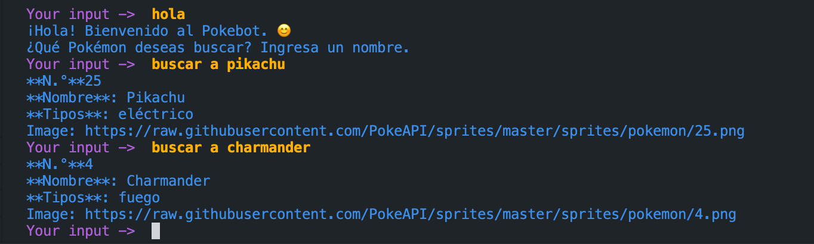
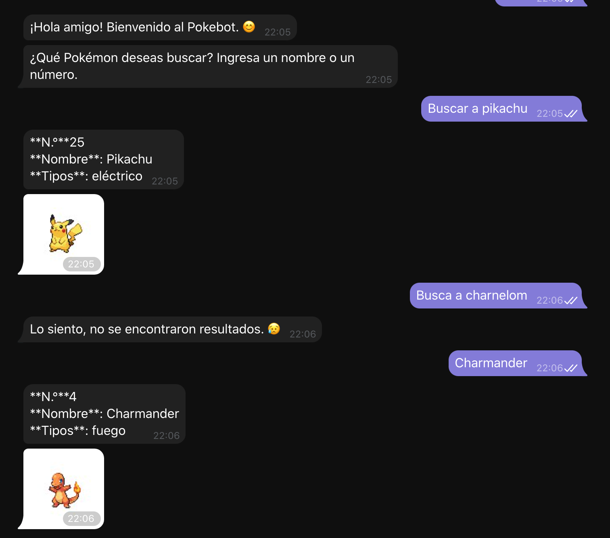

# ChatBot-Pokemon

## Create a Pokémon chatbot in Spanish with RASA
The objective will be to develop a chatbot that allows the user to search for information about any Pokémon, providing its name.
[](images/pokemon.png)

### How will the chatbot know what to look for?
Somehow we need to store the name of the Pokémon to search to be able to use it in the PokéApi. RASA supports Entity Recognition methods, which will be useful for this task.

1. We will start from the config.yml file. First of all, we will enable Entity Recognition in the DIETClassifier component.
2. Now we must teach the chatbot how to recognize the name of a number of Pokémon, for which we will go to the nlu.yml file.

- buscar a [pikachu](nombre_pokemon)  
3. Now that we have told the chatbot how to recognize entities, where does it store them? RASA has slots, which are values stored in the bot's memory during the conversation. To start using slots, we must add them in domain.yml.

* We have declared the entities to recognize pokemon_name, as well as the slot to store pokemon_name. If a slot has the same name as an entity, the identified value of the entity is automatically assigned to that slot.

4. Actions in RASA are pieces of Python code that are executed during conversation. These actions can contain functions of all kinds: executing requests to APIs, operations on databases, calculations, modifying the conversation itself, etc.

* Within the action, to obtain the values stored in the slots we will use the tracker, which is the object that contains all the information of the current conversation. Depending on the slot that we find, the pokemon_name, we will make a request to the PokéApi, with the help of the requests module.

## TRAINING
```python
rasa train
```
## RUN ACTION SERVER
```python
rasa run actions
```
## PREVIEW CHATBOT
```python
rasa shell
```
Now you can talk to the chatbot through the command line. You can interact with the bot in this way:

[](images/test.png)

##### * It should be mentioned that the training has not been intensive nor have we made many adjustments, so it may not work correctly with some Pokémon names.

[](images/ready.png)

## Update Rasa
pip install rasa --upgrade

## Create Virtual Environment 
python3 -m venv env
source env/bin/activate
